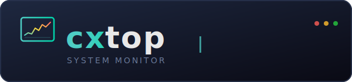
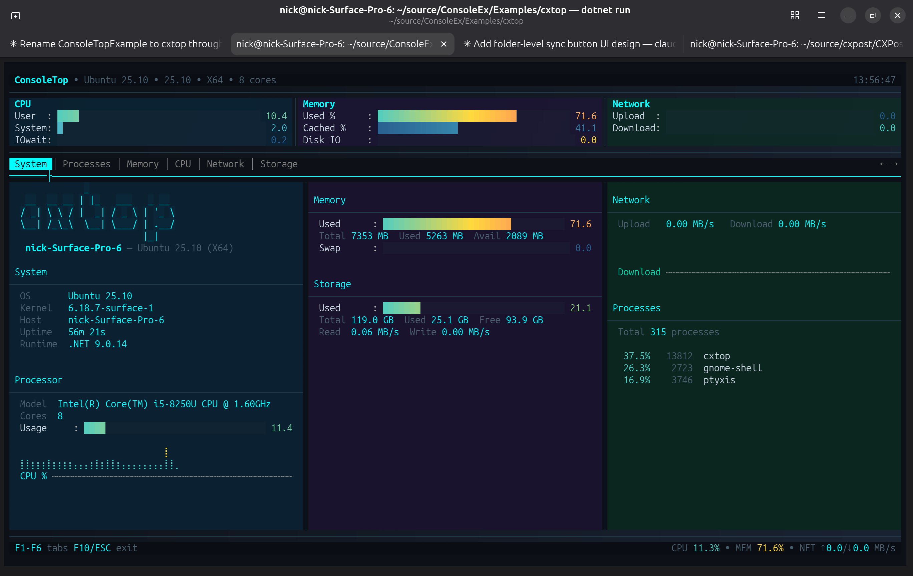

# cxtop

<div align="center">
  
</div>

<div align="center">

[](LICENSE)
[](https://dotnet.microsoft.com/)
[]()

</div>

**An ntop/btop-inspired terminal system monitor built on [SharpConsoleUI](https://github.com/nickprotop/ConsoleEx).**

<div align="center">

### ⭐ If you find cxtop useful, please consider giving it a star! ⭐

It helps others discover the project and motivates continued development.

[](https://github.com/nickprotop/cxtop/stargazers)

</div>

A polished terminal system monitor with a hardware identity dashboard, real-time metrics, sparkline graphs, and process management — all without leaving the terminal.

**Monitor. Manage. Explore.**



## Quick Start

**Option 1: One-line install** (Linux/macOS, no .NET required)
```bash
curl -fsSL https://raw.githubusercontent.com/nickprotop/cxtop/main/install.sh | bash
cxtop
```

**Windows** (PowerShell)
```powershell
irm https://raw.githubusercontent.com/nickprotop/cxtop/main/install.ps1 | iex
```

**Option 2: Build from source** (requires .NET 9)
```bash
git clone https://github.com/nickprotop/cxtop.git
cd cxtop
./build-and-install.sh
cxtop
```

## Features

| | |
|---|---|
| 🖥️ **System Dashboard** | Hardware identity (CPU, GPU, board, BIOS, RAM, audio, display, USB) + live metrics at a glance |
| 📊 **CPU Monitor** | Per-core usage bars, aggregate sparklines, top consumers, user/system/iowait breakdown |
| 🧠 **Memory Monitor** | Used/cached/swap bars with sparklines, buffer and dirty page tracking |
| 🌐 **Network Monitor** | Per-interface upload/download rates, combined sparklines, peak tracking |
| 💾 **Storage Monitor** | Per-disk capacity bars, real-time I/O rates, filesystem details |
| 📋 **Process Manager** | Sortable process list, search/filter, detail panel, SIGTERM/SIGKILL actions |
| 🔍 **Hardware Discovery** | OS, kernel, vendor, board, BIOS, GPU, audio, display, USB, battery, packages, DE, WM, theme |
| 📈 **Sparkline Graphs** | Braille-mode time-series graphs with gradient coloring and history tracking |
| 🎨 **Polished UI** | Gradient backgrounds, semi-transparent panels, smooth bar animations, tab crossfade, bottom fade effect |
| 📐 **Responsive Layout** | Adapts to terminal width and height — 1, 2, or 3 column layouts |
| ⚡ **Cross-Platform** | Linux and Windows support with platform-specific stat collection |
| 🔋 **Battery Aware** | Shows battery percentage and charging status on laptops |

## Keyboard Shortcuts

| Key | Action |
|-----|--------|
| F1-F6 | Switch tabs (System, Processes, Memory, CPU, Network, Storage) |
| Tab | Cycle focus regions (in Processes tab) |
| Enter | Select/activate process |
| S | Cycle sort mode (CPU, Memory, PID, Name) |
| / | Filter processes |
| F10 / ESC | Exit |

## Building from Source

cxtop uses a conditional project reference for [SharpConsoleUI](https://github.com/nickprotop/ConsoleEx):

- **Local development:** If ConsoleEx is cloned as a sibling directory (`../ConsoleEx`), the project reference is used automatically
- **CI/Release builds:** Falls back to the SharpConsoleUI NuGet package

```bash
# Clone both repos as siblings
git clone https://github.com/nickprotop/ConsoleEx.git
git clone https://github.com/nickprotop/cxtop.git

# Build with local ConsoleEx
cd cxtop
dotnet build cxtop/cxtop.csproj

# Or build standalone (uses NuGet)
dotnet build cxtop/cxtop.csproj
```

## Architecture

```
cxtop/
├── cxtop/
│   ├── Program.cs                 # Entry point
│   ├── Configuration/             # App config
│   ├── Dashboard/                 # Main window, tab management
│   ├── Helpers/                   # UI constants, history tracking
│   ├── Stats/                     # System stats providers
│   │   ├── ISystemStatsProvider   # Platform-independent interface
│   │   ├── LinuxSystemStats       # /proc, /sys reader
│   │   └── WindowsSystemStats     # WMI, Performance Counters
│   └── Tabs/                      # Tab implementations
│       ├── SystemInfoTab          # Hardware identity dashboard
│       ├── ProcessTab             # Process list + management
│       ├── CpuTab                 # CPU monitoring
│       ├── MemoryTab              # Memory monitoring
│       ├── NetworkTab             # Network monitoring
│       └── StorageTab             # Storage monitoring
├── publish.sh                     # Release publisher
├── install.sh                     # Linux/macOS installer
└── build-and-install.sh           # Build from source
```

**Key Technologies:** .NET 9, [SharpConsoleUI](https://github.com/nickprotop/ConsoleEx), /proc filesystem (Linux), Performance Counters (Windows)

## Uninstall

**Linux/macOS:**
```bash
cxtop-uninstall.sh
```

**Windows (PowerShell):**
```powershell
& "$env:LOCALAPPDATA\cxtop\cxtop-uninstall.ps1"
```

## License

MIT License. See [LICENSE](LICENSE) for details.
